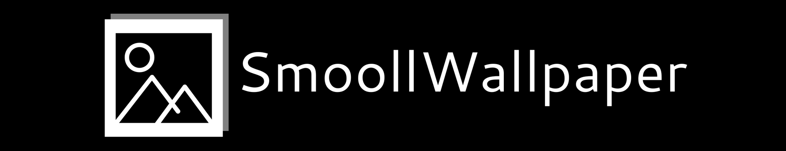

# SmoollWallpaper

	
	<i>"Smooll" pronounced "small".</i>

SmoollWallpaper (swall, pronounced `swall` and not `s-wall`) is a simple Python script for setting video wallpapers on Linux.

***

	
	
	
	

	
	
	
	
	
	
	

***

## Overview
SmoollWallpaper uses the magic of `mpv` and `xwinwrap` to display animated (or just video) wallpapers on your desktop, and with the help of `xprop` it allows the wallpapers to stop when you click on another window than your desktop, if you're PC or laptop don't have the best of specs just like me :).

It also allows using images as wallpapers, but this option is `WIP` (Work In Progress) and only available for `GNOME`, `LXDE/PCmanFM`, `LXQt/PCmanFM-qt` and `KDE >=5.7`, although I don't know about KDE because I haven't tested it yet, but if you'd like to contribute to this project, you can test it out and let me know by opening an issue.

If you'd like to get started on using my magnum opus ('cause let's be honest, I will probably never make something better), you can go to the [Getting Started wiki page](https://www.github.com/reallySmooll/smoollwallpaper/wiki/Getting-Started) or you can click on one of the badges above that says `GETTING STARTED`. There's a normal wallpaper version as well. You can go [here](https://www.github.com/reallySmooll/smoollwallpaper/wiki/Getting-Started-(Normal-Wallpapers)) or you can click on the `GETTING STARTED (NORMAL WALLPAPERS)` badge above.

Happy desktop customization! :D

 

***

## Features

- [x] Video wallpapers

- [x] Script pauses automatically if desktop is not focused

- [x] Option to not pause the script automatically when the desktop is not focused

- [x] Normal wallpapers (desktops supported):
	- GNOME

- [ ] Full rewrite with graphical interface (coming, v2.0.0)

I will come up with more features in the future :)

***

### NOTE: THIS SCRIPT ONLY WORKS ON LINUX (X11)
